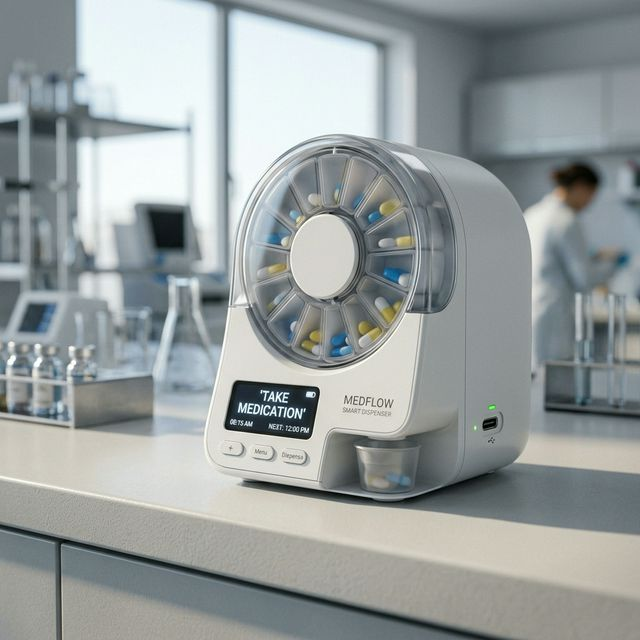

# 💊 Smart Pill Dispenser 1.0 - ESP32-S3 Powered



## 🚀 Overview

The **Pill Dispenser 1.0** is a high-performance, compact, and automated solution for medication management. Powered by an **ESP32-S3**, this version integrates smart scheduling, Li-Ion battery management, and an OLED interface for a seamless user experience.

Designed with precision in **KiCad**, the PCB is optimized for a **50mm x 40mm** footprint, making it ideal for portable or space-constrained medical IoT applications.

---

## ✨ Key Features

- 🧠 **ESP32-S3-WROOM-1**: High-performance dual-core MCU with Wi-Fi & Bluetooth.
- 🔋 **Li-Ion Management**: Integrated TP4056 charging circuit via USB-C.
- ⚙️ **Mechanism**: Precise servo motor control for rotating pill compartments.
- 🖥️ **User Interface**: 128x64 OLED display for status alerts and pill reminders.
- 🔔 **Alert System**: Onboard SMD buzzer (via transistor driver) and multi-color status LEDs.
- 🔌 **USB-C Connectivity**: Modern power delivery and data access.
- 📏 **Compact PCB**: 2-layer design (50x40mm) with optimized SMD placement.

---

## 🛠️ Hardware Specifications

### Power Section
- **Charger IC**: TP4056 (USB-C 5V Input)
- **LDO**: AP2112K-3.3V (600mA low-noise)
- **Protection**: 1N5819 Schottky reverse polarity protection.

### Microcontroller Section
- **MCU**: ESP32-S3-WROOM-1 (4MB Flash)
- **Buttons**: Boot, Reset, and a dedicated User Input button.
- **I2C Pull-ups**: 4.7kΩ on SDA/SCL.

### Peripherals
- **OLED**: I2C Interface (GND, VCC, SCL, SDA)
- **Servo**: 3-pin standard header (PWM controlled)
- **Buzzer**: SMD 5020 with MMBT2222A driver.

---

## 📁 Repository Structure

```text
├── assets/                  # High-quality project renders and visual assets
├── gerbers/                 # PCB manufacturing files (RS-274X)
├── bom/                     # Bill of Materials (CSV/PDF)
├── Pill_Dispenser_V4.kicad_pcb  # Main PCB Layout
├── Pill_Dispenser_V4.kicad_sch  # Main Schematic
├── LICENSE                  # MIT License
└── README.md                # Project documentation
```

---

## 🏗️ Getting Started

### Design Files
The hardware was designed using **KiCad 8.0+**. To view or modify the project:
1. Clone the repository.
2. Open `Pill_Dispenser_V4.kicad_pro`.
3. Ensure the required library footprints are linked (or use the built-in caches).

### Manufacturing
The `Pill_Dispenser_V4_Gerber.zip` contains all necessary files for fabrication (JLCPCB, PCBWay, etc.).
- **Material**: FR4
- **Thickness**: 1.6mm
- **Finish**: Lead-free HASL (Recommended)

---

## 📜 License

This project is licensed under the **MIT License** - see the [LICENSE](LICENSE) file for details.

---

## 🌍 Connect
*Feel free to star the repo ⭐️ if you find this useful!*
